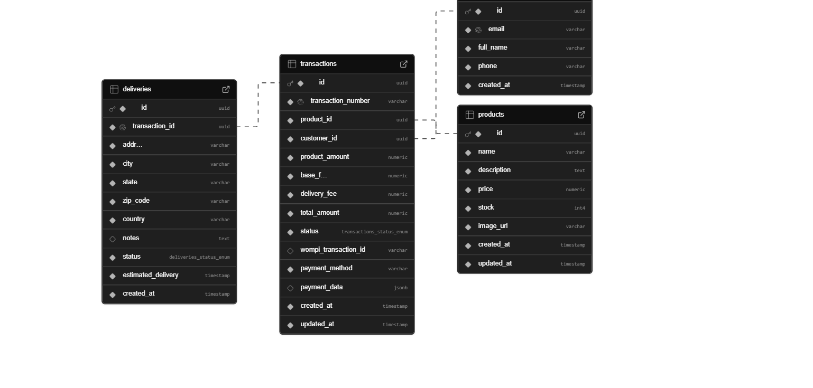
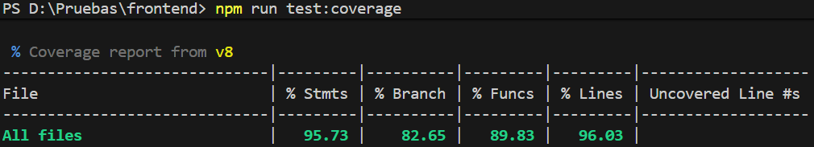
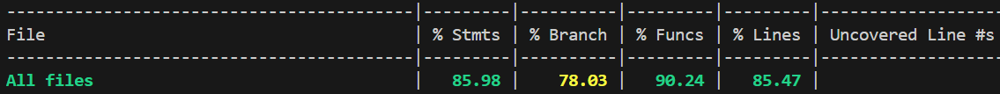

# Payment Checkout Application

A full-stack e-commerce payment checkout application with credit card processing.

## 🏗️ Architecture

- **Frontend**: React + TypeScript + Redux Toolkit
- **Backend**: NestJS + TypeScript + Hexagonal Architecture
- **Database**: PostgreSQL
- **Payment**: Integration with payment gateway
- **Deploy**: AWS (S3, CloudFront, ECS, RDS)

## 📋 Prerequisites

- Node.js 20+
- PostgreSQL
- Docker & Docker Compose

## 🚀 Quick Start

### Development

```bash
# Clone repository
git clone https://github.com/Jose0808/payment-checkout-app

# Start all services
docker-compose up -d

# Frontend
cd frontend
npm install
npm run dev

# Backend
cd backend
npm install
npm run start:dev
```

### Testing

```bash
# Frontend tests
cd frontend
npm test -- --coverage

# Backend tests
cd backend
npm test -- --coverage
```

## 📁 Project Structure

```
payment-checkout-app/
├── frontend/          # React SPA
└── backend/           # NestJS API
```

## 🏛️ Architecture Patterns

- **Hexagonal Architecture** (Ports & Adapters)
- **Railway Oriented Programming**
- **SOLID Principles**
- **Clean Code**

## 📊 Test Coverage

- Frontend: TBD%
- Backend: TBD%

## 🔐 Security

- HTTPS enabled
- Security headers configured
- OWASP best practices
- Sensitive data encryption

## 📚 API Documentation

- Swagger UI: `https://payment-checkout-app.onrender.com/api/docs`

## 🗄️ Database Schema




### Cobertura Actual

Front:


Back:


### Cloud Environment

https://dashboard.render.com/project/prj-d44p8mmuk2gs73fjun4g/environment/evm-d44p8mmuk2gs73fjun50

## 📝 License

MIT

## 👥 Author

Jose Colmenares
